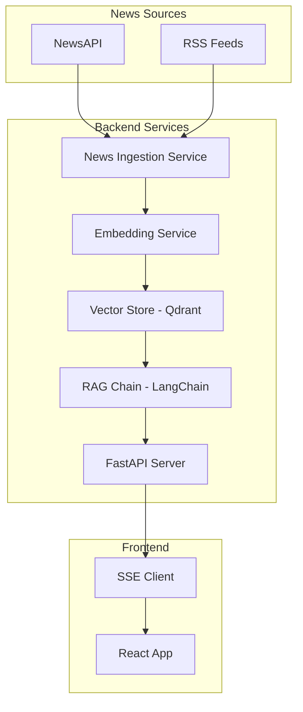

# Crypto News Agent

Real-time crypto news Q&A system, built with FastAPI, LangChain, React, and Qdrant.

## System Architecture



## Features

- **Real-time News Ingestion**: Fetches crypto news every 2 minutes from multiple sources
- **Semantic Search**: Uses OpenAI embeddings for accurate article retrieval
- **RAG-powered Q&A**: LangChain-based retrieval-augmented generation
- **Streaming Responses**: Word-by-word streaming via Server-Sent Events
- **Content Moderation**: Basic filtering for inappropriate requests
- **Conversation History**: Context-aware responses using chat history

## Quick Start

1. **Clone the repository**:
   ```bash
   git clone https://github.com/ToJen/crypto-news-agent
   cd crypto_news_agent
   ```

2. **Set up the backend**:
   ```bash
   cd backend
   poetry install
   cp .env.example .env
   # Edit .env with your API keys
   poetry run uvicorn app.main:app --reload
   ```

3. **Set up the frontend**:
   ```bash
   cd frontend
   npm install
   npm run dev
   ```

4. **Access the application**:
   - Frontend: http://localhost:5173
   - Backend API: http://localhost:8000

## Tech Stack

- **Backend**: FastAPI, LangChain, OpenAI, Qdrant
- **Frontend**: React, TypeScript, Tailwind CSS, Vite
- **News Sources**: NewsAPI, RSS feeds (CoinDesk, Cointelegraph)
- **Vector Database**: Qdrant
- **Embeddings**: OpenAI text-embedding-ada-002

## Documentation

- [Backend Documentation](./backend/README.md)
- [Frontend Documentation](./frontend/README.md)
